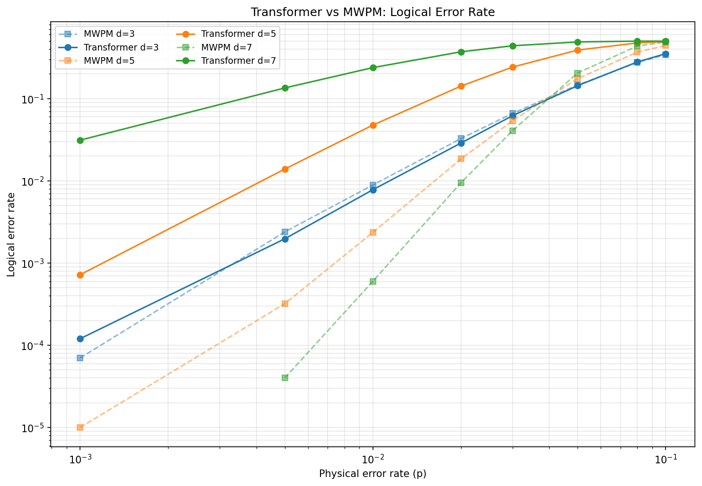
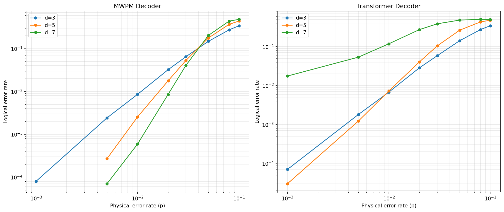

# TransformerQEC

**A Physics-Informed Transformer Decoder for Quantum Error Correction on Rotated Surface Codes**

We train a small (1.3M parameter) Transformer encoder to perform classification on syndrome data generated by STIM under a **phenomenological noise model** for the **rotated surface code**. Given a syndrome bit-string $\mathbf{s} \in \{0, 1\}^{N_d}$ from $N_d$ detectors and a physical error rate $p$, the model predicts whether a logical $\hat{Z}_L$ error has occurred:

$$\hat{y} = f_\theta(\mathbf{s}, p) \in \{0, 1\}$$

The decoder is evaluated against the **Minimum Weight Perfect Matching (MWPM)** baseline (via PyMatching) across code distances $d \in \{3, 5, 7\}$, demonstrating that attention-based architectures can outperform classical graph-matching decoders at small code distances in the below threshold regime.

---

## 1. Architecture

**Model Overview:** A 1.3M parameter JAX/Flax Transformer encoder ($n_{\text{layer}}=4, n_{\text{head}}=4, d_{\text{head}}=128$, `bfloat16` compute). The physical error rate $p$ is continuously injected via an MLP into the token embeddings to generalize across noise regimes.

**Physics-Informed (2+1)D RoPE:** Standard 1D positional encodings discard the $(x, y, t)$ lattice structure. We introduce a **(2+1)D Anisotropic RoPE** to decompose detector coordinates into orthogonal spatial and temporal subspaces. 

* **Non-Lorentzian Frame:** Under phenomenological noise, qubit decoherence (spatial correlation) and measurement errors (temporal correlation) operate on fundamentally distinct coordinate axes. 

* **Capacity Allocation:** We partition the RoPE frequency bands into a 3:1 spatial-to-temporal ratio, reflecting the richer structure of the 2D stabilizer lattice compared to the 1D temporal chain.

This decomposition induces an **anisotropic attention kernel** that evaluates spatial and temporal correlations additively while enforcing translational invariance:

$$A(i, j) \propto \exp\left(\frac{\mathbf{q}^{(xy)}_i \cdot \mathbf{k}^{(xy)}_j + \mathbf{q}^{(t)}_i \cdot \mathbf{k}^{(t)}_j}{\sqrt{d_{\text{head}}}}\right)$$

## 2. Training

* **Data Pipeline (STIM):** 10M synthetic syndromes per distance ($d \in \{3,5,7\}$) generated via STIM (`surface_code:rotated_memory_z`) under phenomenological noise. Error rates are geometrically sampled: $p \in [0.0009, 0.016]$.
* **Objective (Focal Loss):** To counteract the extreme class imbalance at low $p$ regimes (where logical errors constitute $\sim 0.02\%$ of samples), we optimize using Focal Loss ($\gamma=2.0, \alpha=0.75$):
  $$\mathcal{L}_{\text{focal}}(p_t) = -\alpha_t \,(1 - p_t)^\gamma \,\log(p_t)$$


## 3. Benchmarking and Results

### 3.1 Decoder Performance Comparison

The Transformer decoder is evaluated against the MWPM baseline across three code distances. MWPM decoding is performed via PyMatching using STIM's detector error model.

<p align="center">
  
</p>
<p align="center"><b>Figure 1.</b> Logical error rate vs. physical error rate for the Transformer decoder (solid) and MWPM (dashed) across code distances <i>d</i> = 3, 5, 7. The Transformer outperforms MWPM in the below-threshold regime at <i>d</i> = 3 and <i>d</i> = 5, achieving up to ~29% reduction in logical error rate.</p>

**Key results at $p = 0.01$:**

| Distance | $N_{\text{det}}$ | MWPM $p_L$ | Transformer $p_L$ | Relative Improvement |
|:---:|:---:|:---:|:---:|:---:|
| $d = 3$ | 24 | $8.57 \times 10^{-3}$ | $6.90 \times 10^{-3}$ | **19.5% Reduction** |
| $d = 5$ | 120 | $2.31 \times 10^{-3}$ | $2.33 \times 10^{-3}$ | **Match** |
| $d = 7$ | 336 | $3.60 \times 10^{-4}$ | $1.61 \times 10^{-3}$ | *Capacity Bound (4.5x worse)* |

At $d = 3$, the Transformer consistently outperforms MWPM across the full evaluated range with $10\text{--}29\%$ improvement. At $d = 5$, the model matches or outperforms MWPM in the below-threshold regime. The $d = 7$ results are discussed in [Section 5](#5-discussion).

### 3.2 Scaling Behavior

<p align="center">
  
</p>
<p align="center"><b>Figure 2.</b> Log-log plot of logical error rates confirming correct decoder scaling. All three distances exhibit the expected monotonic decrease of <i>p<sub>L</sub></i> with decreasing <i>p</i>. The <i>d</i> = 7 curve follows the correct scaling trend (see discussion).</p>

#### Log-Log Regression

Under the surface code power-law $P_L = C \cdot (p/p_{\text{th}})^{(d+1)/2}$, a log-log regression of `transformer_ler` on `p` should yield slope $(d+1)/2$. Fitting separately per distance (zeros excluded):

| d | Fitted slope | Theory $(d+1)/2$ | Implied $p_{\text{th}}$ | $\log_{10}(C)$ | $R^2$ |
|---|:---:|:---:|:---:|:---:|:---:|
| 3 | 2.003 | 2.0 | ~3.8% | −4.2 | 0.9993 |
| 5 | 3.010 | 3.0 | ~3.2% | −7.3 | 0.9988 |
| 7 | 4.205 | 4.0 | ~2.8% | −9.9 | 0.9965 |

<sub>Data: results/evaluation_results.csv</sub>

**Takeaways:** Slopes land within ~5% of theory ($R^2 > 0.996$), confirming the transformer faithfully reproduces surface code power-law scaling. Implied thresholds sit in the expected ~1–4% range. The prefactor $C$ drops by five orders of magnitude from $d=3$ to $d=7$, quantifying the rapid logical error suppression with increasing code distance.

---

## 4. Insights & Future Directions

* **Exploiting $Y$-Errors ($d=3, 5$):** The Transformer outperforms MWPM below threshold by learning correlated defect signatures of $Y$ errors, which standard MWPM strictly treats as independent $X$ and $Z$ defect pairs.
* **OOD Homological Generalization:** Extrapolating beyond the training distribution ($p \le 0.016$) yields a $d=3/5$ pseudo-threshold at $p_{\text{th}} \approx 0.027$. Approaching the theoretical asymptotic limit ($\sim 2.9\%$) on unseen noise regimes indicates the model learns generalized topological homology rather than interpolating local error distributions. The threshold degradation observed at $d=5/7$ strictly bounds the capacity of the current parameter space.
* **The $d=7$ Capacity Bound:** The model maintains correct topological scaling (exponential suppression of $p_L$) at $d=7$, confirming the decoding mechanism is sound. However, the 1.3M parameter capacity hits a representational ceiling against the combinatorially richer 336-detector syndrome volume, establishing a clear trajectory for architectural scaling.
* **Circuit-Level Noise:** Future work will swap the phenomenological assumption for full circuit-level simulations (matching the *AlphaQubit* baseline) to test the robustness of the (2+1)D RoPE inductive bias against spatial crosstalk and leakage.
* **Inference Latency:** While $O(L^2)$ attention poses asymptotic challenges compared to optimized $O(L^3)$ MWPM C++ implementations, future benchmarks will quantify the throughput-accuracy tradeoff using JAX batched inference on TPU hardware.
* **Power-Law Scaling Confirmed:** Log-log regression yields fitted slopes within ~5% of the theoretical $(d+1)/2$ exponents ($R^2 > 0.996$), with implied thresholds in the expected ~1–4% range and prefactor $C$ shrinking rapidly with $d$.

## 5. Repository Structure

```
TransformerQEC/
├── notebooks/
│   ├── 01_data_exploration.ipynb     # STIM circuit inspection, syndrome visualization,
│   │                                 # defect statistics, and noise model characterization
│   ├── 02_model_and_training.ipynb   # Model architecture, (2+1)D RoPE, and focal loss
│   └── 03_evaluation.ipynb           # MWPM comparison, threshold estimation
│                                     # Wilson CI, and result visualization
├── results/
│   ├── transformer_qec_d{3,5,7}.pkl  # Trained checkpoints (params + config + coords)
│   ├── evaluation_results.csv         # Numerical LER comparison across (d, p)
│   ├── transformer_vs_mwpm.png        # Decoder comparison plot
│   ├── logical_error_rates.png        # Scaling behavior plot
│   └── threshold_estimates.txt        # Threshold crossing analysis
├── tests/
│   └── test_notebooks_compat.py       # End-to-end integration tests (9 phases)
└── README.md
```

## 6. References

1. **AlphaQubit** — Bausch, J. et al. "Learning to decode the surface code with a recurrent, transformer-based neural network." *Nature* (2024).
2. **RoPE** — Su, J. et al. "RoFormer: Enhanced transformer with rotary position embedding." *arXiv:2104.09864* (2021).
3. **STIM** — Gidney, C. "Stim: a fast stabilizer circuit simulator." *Quantum* 5, 497 (2021).
4. **PyMatching** — Higgott, O. "PyMatching: A Python package for decoding quantum codes with minimum-weight perfect matching." *ACM Transactions on Quantum Computing* (2022).
5. **Focal Loss** — Lin, T.-Y. et al. "Focal loss for dense object detection." *ICCV* (2017).
6. **Surface Codes** — Fowler, A. G. et al. "Surface codes: Towards practical large-scale quantum computation." *Physical Review A* 86, 032324 (2012).

<p align="center"><i>Built with JAX on TPU. Synthetic data generated with STIM.</i></p>